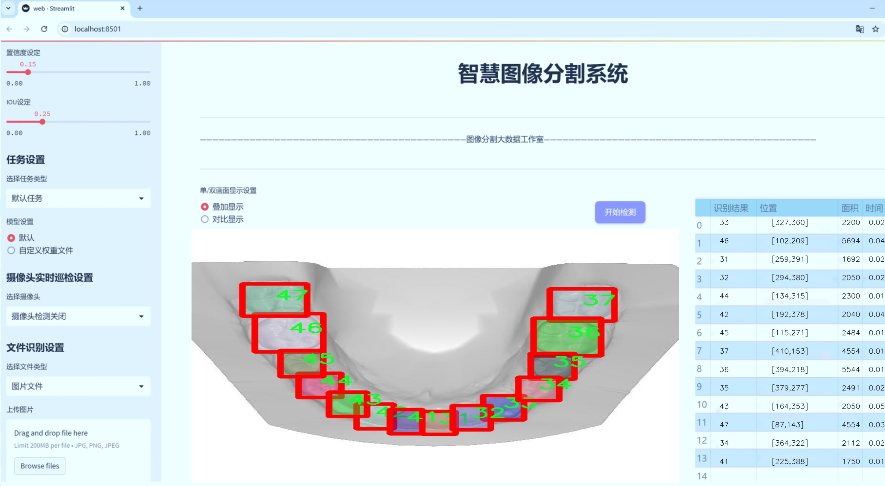
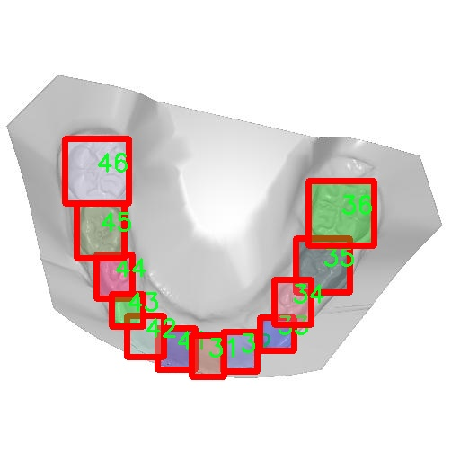

# 牙科图像分割系统源码＆数据集分享
 [yolov8-seg-aux＆yolov8-seg-C2f-Faster等50+全套改进创新点发刊_一键训练教程_Web前端展示]

### 1.研究背景与意义

项目参考[ILSVRC ImageNet Large Scale Visual Recognition Challenge](https://gitee.com/YOLOv8_YOLOv11_Segmentation_Studio/projects)

项目来源[AAAI Global Al lnnovation Contest](https://kdocs.cn/l/cszuIiCKVNis)

研究背景与意义

随着数字化技术的迅猛发展，医学影像处理在临床诊断和治疗中的应用日益广泛。尤其在牙科领域，精确的图像分割技术对于疾病的早期诊断、治疗方案的制定以及术后效果的评估具有重要意义。传统的牙科图像处理方法往往依赖于人工标注和经验判断，存在主观性强、效率低下等问题。因此，开发一种高效、准确的自动化牙科图像分割系统，成为了当前研究的热点之一。

近年来，深度学习技术的快速发展为医学图像处理提供了新的解决方案。YOLO（You Only Look Once）系列模型因其优越的实时性和准确性，已被广泛应用于目标检测和图像分割任务。YOLOv8作为该系列的最新版本，进一步提升了模型的性能和适用性，尤其在处理复杂背景和多类别目标时表现出色。然而，现有的YOLOv8模型在牙科图像分割任务中的应用仍显不足，亟需针对牙科图像的特性进行改进和优化。

本研究旨在基于改进的YOLOv8模型，构建一个高效的牙科图像分割系统。我们将利用包含1200幅牙科图像的数据集，该数据集涵盖了33个类别，涉及11个不同的牙科相关类目。通过对这些数据的深入分析与处理，期望能够提高模型在牙科图像分割中的表现。具体而言，研究将聚焦于如何利用改进的YOLOv8模型，针对牙科图像的特征进行特定的调整，以提高分割的精度和速度。

在牙科图像分割的实际应用中，精确的分割结果不仅能够帮助医生更好地识别和定位病变区域，还能为后续的治疗提供重要依据。此外，自动化的分割系统可以显著降低医生的工作负担，提高诊断效率，进而提升患者的就医体验。因此，研究基于改进YOLOv8的牙科图像分割系统，不仅具有重要的学术价值，也具备广泛的临床应用前景。

本研究的意义还在于推动牙科影像处理领域的技术进步。通过对YOLOv8模型的改进与优化，探索其在牙科图像分割中的应用，将为后续相关研究提供新的思路和方法。同时，研究结果有望为其他医学影像处理领域的深度学习应用提供借鉴，促进跨学科的技术交流与合作。

综上所述，基于改进YOLOv8的牙科图像分割系统的研究，不仅是对现有技术的创新与提升，更是对未来牙科诊疗模式的积极探索。通过实现高效、准确的自动化分割，能够为牙科临床实践带来革命性的变化，推动医学影像处理技术的发展，最终造福广大患者。

### 2.图片演示





##### 注意：由于此博客编辑较早，上面“2.图片演示”和“3.视频演示”展示的系统图片或者视频可能为老版本，新版本在老版本的基础上升级如下：（实际效果以升级的新版本为准）

  （1）适配了YOLOV8的“目标检测”模型和“实例分割”模型，通过加载相应的权重（.pt）文件即可自适应加载模型。

  （2）支持“图片识别”、“视频识别”、“摄像头实时识别”三种识别模式。

  （3）支持“图片识别”、“视频识别”、“摄像头实时识别”三种识别结果保存导出，解决手动导出（容易卡顿出现爆内存）存在的问题，识别完自动保存结果并导出到tempDir中。

  （4）支持Web前端系统中的标题、背景图等自定义修改，后面提供修改教程。

  另外本项目提供训练的数据集和训练教程,暂不提供权重文件（best.pt）,需要您按照教程进行训练后实现图片演示和Web前端界面演示的效果。

### 3.视频演示

[3.1 视频演示](https://www.bilibili.com/video/BV1EAyaYTEnx/)

### 4.数据集信息展示

##### 4.1 本项目数据集详细数据（类别数＆类别名）

nc: 32
names: ['11', '12', '13', '14', '15', '16', '17', '18', '21', '22', '23', '24', '25', '26', '27', '28', '31', '32', '33', '34', '35', '36', '37', '38', '41', '42', '43', '44', '45', '46', '47', '48']


##### 4.2 本项目数据集信息介绍

数据集信息展示

在本研究中，我们采用了名为“Dental”的数据集，以改进YOLOv8-seg的牙科图像分割系统。该数据集专门针对牙科领域的图像处理，旨在提高牙科图像的分割精度和效率，从而为临床诊断和治疗提供更为精准的支持。数据集包含32个类别，涵盖了牙科图像中常见的各种结构和病变，具体类别包括：11、12、13、14、15、16、17、18、21、22、23、24、25、26、27、28、31、32、33、34、35、36、37、38、41、42、43、44、45、46、47、48。这些类别的设计充分考虑了牙科领域的专业需求，确保了数据集的多样性和代表性。

“Dental”数据集的构建过程涉及多个步骤，包括数据采集、标注和预处理。首先，数据采集阶段通过与多家牙科医院和诊所的合作，收集了大量的牙科图像。这些图像涵盖了不同类型的牙齿、牙龈及相关组织，确保了数据集的全面性。其次，在标注阶段，专业的牙科医生对收集到的图像进行了细致的标注，确保每个类别的准确性和一致性。这一过程不仅提高了数据集的质量，也为后续的模型训练提供了可靠的基础。

数据集中的每个类别都代表了牙科图像中的特定结构或病变。例如，类别11可能代表某种特定类型的牙齿，而类别22则可能对应于牙龈的某种病变。这种细致的分类使得模型在训练过程中能够学习到不同类别之间的特征差异，从而在实际应用中实现更为精准的分割效果。此外，数据集中的图像还经过了多种预处理操作，如归一化、增强等，以提高模型的鲁棒性和泛化能力。

在模型训练过程中，YOLOv8-seg将利用“Dental”数据集进行多轮迭代训练，通过不断调整模型参数，优化分割效果。由于数据集的多样性和丰富性，模型能够在面对不同类型的牙科图像时，保持较高的分割精度。这对于临床医生在进行牙科诊断时，能够提供更为清晰的图像分割结果，从而辅助其做出更为准确的判断。

总之，“Dental”数据集不仅为YOLOv8-seg的训练提供了坚实的基础，也为牙科图像分割领域的研究和应用开辟了新的方向。通过对该数据集的深入分析和利用，我们期望能够推动牙科图像处理技术的发展，提高牙科诊断的效率和准确性，为患者提供更好的医疗服务。




### 5.全套项目环境部署视频教程（零基础手把手教学）

[5.1 环境部署教程链接（零基础手把手教学）](https://www.bilibili.com/video/BV1jG4Ve4E9t/?vd_source=bc9aec86d164b67a7004b996143742dc)


[5.2 安装Python虚拟环境创建和依赖库安装视频教程链接（零基础手把手教学）](https://www.bilibili.com/video/BV1nA4VeYEze/?vd_source=bc9aec86d164b67a7004b996143742dc)

### 6.手把手YOLOV8-seg训练视频教程（零基础小白有手就能学会）

[6.1 手把手YOLOV8-seg训练视频教程（零基础小白有手就能学会）](https://www.bilibili.com/video/BV1cA4VeYETe/?vd_source=bc9aec86d164b67a7004b996143742dc)


按照上面的训练视频教程链接加载项目提供的数据集，运行train.py即可开始训练



     Epoch   gpu_mem       box       obj       cls    labels  img_size
     1/200     0G   0.01576   0.01955  0.007536        22      1280: 100%|██████████| 849/849 [14:42<00:00,  1.04s/it]
               Class     Images     Labels          P          R     mAP@.5 mAP@.5:.95: 100%|██████████| 213/213 [01:14<00:00,  2.87it/s]
                 all       3395      17314      0.994      0.957      0.0957      0.0843

     Epoch   gpu_mem       box       obj       cls    labels  img_size
     2/200     0G   0.01578   0.01923  0.007006        22      1280: 100%|██████████| 849/849 [14:44<00:00,  1.04s/it]
               Class     Images     Labels          P          R     mAP@.5 mAP@.5:.95: 100%|██████████| 213/213 [01:12<00:00,  2.95it/s]
                 all       3395      17314      0.996      0.956      0.0957      0.0845

     Epoch   gpu_mem       box       obj       cls    labels  img_size
     3/200     0G   0.01561    0.0191  0.006895        27      1280: 100%|██████████| 849/849 [10:56<00:00,  1.29it/s]
               Class     Images     Labels          P          R     mAP@.5 mAP@.5:.95: 100%|███████   | 187/213 [00:52<00:00,  4.04it/s]
                 all       3395      17314      0.996      0.957      0.0957      0.0845


### 7.50+种全套YOLOV8-seg创新点代码加载调参视频教程（一键加载写好的改进模型的配置文件）

[7.1 50+种全套YOLOV8-seg创新点代码加载调参视频教程（一键加载写好的改进模型的配置文件）](https://www.bilibili.com/video/BV1Hw4VePEXv/?vd_source=bc9aec86d164b67a7004b996143742dc)

### 8.YOLOV8-seg图像分割算法原理

原始YOLOv8-seg算法原理

YOLOv8-seg是YOLO系列中的一项重要进展，旨在解决目标检测和分割任务中的一些关键挑战。作为YOLOv8的延伸，YOLOv8-seg不仅继承了YOLOv8的高效架构，还针对分割任务进行了优化，结合了最新的深度学习技术，特别是在处理复杂背景和小目标方面的能力。该算法的核心在于其高效的特征提取、上下文信息的整合以及精确的目标定位。

YOLOv8-seg的架构由四个主要模块组成：输入端、主干网络、Neck端和输出端。输入端负责对输入图像进行预处理，包括Mosaic数据增强、自适应图片缩放和灰度填充等，这些步骤旨在提升模型的鲁棒性和泛化能力。尽管Mosaic增强在一定程度上可能破坏数据的真实分布，但YOLOv8-seg通过在训练的最后阶段停止使用此增强方法，来缓解这一问题。

在主干网络中，YOLOv8-seg采用了C2f模块，这一模块在YOLOv5的C3模块基础上进行了改进，引入了更多的跳层连接和双层路由注意力机制。C2f模块通过增强梯度流和特征重用，能够有效提取图像中的细粒度特征，从而提升对小目标的感知能力。这一设计不仅保证了模型的轻量化，还提高了特征提取的精度。

Neck端采用了PAN（Path Aggregation Network）结构，通过上采样和下采样的特征融合，YOLOv8-seg能够有效整合不同尺度的特征图。这一过程确保了模型在处理多尺度目标时的准确性，尤其是在复杂的水面环境中，能够更好地应对小目标漂浮物的检测任务。Neck端的设计也引入了GSConv和Slim-neck技术，这些技术在保持检测精度的同时，显著降低了计算量，提升了模型的推理速度。

输出端则采用了解耦头结构，这一结构将分类和回归任务分开处理，使得模型在执行目标检测和分割时能够更加高效。YOLOv8-seg通过Task-Aligned Assigner方法，对分类分数和回归分数进行加权，从而优化正样本的匹配过程。损失计算方面，YOLOv8-seg使用了MPDIoU损失函数替代了传统的CIoU损失函数，这一改进旨在提高模型的泛化能力和精准度，尤其是在小目标检测和复杂背景下的表现。

在具体实现中，YOLOv8-seg在特征提取时引入了远程依赖的捕获思想，采用BiFormer双层路由注意力机制，以保留特征提取过程中更细粒度的上下文信息。这一机制使得模型在处理复杂场景时，能够更好地理解目标与背景之间的关系，从而减少定位误差。此外，针对小目标漏检的问题，YOLOv8-seg特别添加了一个更小的检测头，以提升网络对小目标的感知力。

YOLOv8-seg的创新之处还在于其对损失函数的优化，MPDIoU损失函数通过考虑目标框的重叠度和中心点距离，能够更全面地评估模型的预测效果。这一损失函数的引入，使得模型在训练过程中能够更好地学习到目标的空间关系，从而提高了检测的准确性。

在实验中，YOLOv8-seg在多个数据集上表现出色，尤其是在复杂的水面环境中，其检测精度和速度均优于传统的anchor-based方法。这一成果不仅验证了YOLOv8-seg在目标检测和分割任务中的有效性，也为未来的研究提供了新的思路和方向。

总的来说，YOLOv8-seg通过一系列创新的设计和技术改进，成功地提升了目标检测和分割的性能，尤其是在处理复杂背景和小目标时的能力。这一算法的提出，不仅为YOLO系列的发展注入了新的活力，也为相关领域的研究提供了重要的参考和借鉴。随着深度学习技术的不断进步，YOLOv8-seg无疑将在实际应用中发挥越来越重要的作用。


### 9.系统功能展示（检测对象为举例，实际内容以本项目数据集为准）

图9.1.系统支持检测结果表格显示

  图9.2.系统支持置信度和IOU阈值手动调节

  图9.3.系统支持自定义加载权重文件best.pt(需要你通过步骤5中训练获得)

  图9.4.系统支持摄像头实时识别

  图9.5.系统支持图片识别

  图9.6.系统支持视频识别

  图9.7.系统支持识别结果文件自动保存

  图9.8.系统支持Excel导出检测结果数据


### 10.50+种全套YOLOV8-seg创新点原理讲解（非科班也可以轻松写刊发刊，V11版本正在科研待更新）

#### 10.1 由于篇幅限制，每个创新点的具体原理讲解就不一一展开，具体见下列网址中的创新点对应子项目的技术原理博客网址【Blog】：


[10.1 50+种全套YOLOV8-seg创新点原理讲解链接](https://gitee.com/qunmasj/good)

#### 10.2 部分改进模块原理讲解(完整的改进原理见上图和技术博客链接)【如果此小节的图加载失败可以通过CSDN或者Github搜索该博客的标题访问原始博客，原始博客图片显示正常】
### YOLOv8简介
YOLO（You Only Look Once）是一种流行的对象检测和图像分割模型，由华盛顿大学的Joseph Redmon和Ali Farhadi开发。YOLO于2015年推出，以其高速度和高精度迅速走红。

YOLOv2于2016年发布，通过合并批处理规范化、锚盒和维度集群来改进原始模型
2018年推出的YOLOv3使用更高效的骨干网络、多个锚点和空间金字塔池进一步增强了该模型的性能
YOLOv4于2020年发布，引入了Mosaic数据增强、新的无锚检测头和新的丢失功能等创新
YOLOv5进一步提高了模型的性能，并添加了超参数优化、集成实验跟踪和自动导出到流行导出格式等新功能
YOLOv6于2022年由美团开源，目前正在该公司的许多自动配送机器人中使用
YOLOv7在COCO关键点数据集上添加了额外的任务，如姿态估计
YOLOv8是Ultralytics公司推出的YOLO的最新版本。作为一款尖端、最先进的（SOTA）车型，YOLOv8在之前版本的成功基础上，引入了新的功能和改进，以增强性能、灵活性和效率。YOLOv8支持全方位的视觉AI任务，包括检测、分割、姿态估计、跟踪和分类。这种多功能性允许用户在不同的应用程序和域中利用YOLOv8的功能
#### YOLOv8的新特性与可用模型

Ultralytics 并没有直接将开源库命名为 YOLOv8，而是直接使用 ultralytics 这个词，原因是 ultralytics 将这个库定位为算法框架，而非某一个特定算法，一个主要特点是可扩展性。其希望这个库不仅仅能够用于 YOLO 系列模型，而是能够支持非 YOLO 模型以及分类分割姿态估计等各类任务。总而言之，ultralytics 开源库的两个主要优点是：

融合众多当前 SOTA 技术于一体
未来将支持其他 YOLO 系列以及 YOLO 之外的更多算法
Ultralytics为YOLO模型发布了一个全新的存储库。它被构建为 用于训练对象检测、实例分割和图像分类模型的统一框架。

提供了一个全新的 SOTA 模型，包括 P5 640 和 P6 1280 分辨率的目标检测网络和基于 YOLACT 的实例分割模型。和 YOLOv5 一样，基于缩放系数也提供了 N/S/M/L/X 尺度的不同大小模型，用于满足不同场景需求
骨干网络和 Neck 部分可能参考了 YOLOv7 ELAN 设计思想，将 YOLOv5 的 C3 结构换成了梯度流更丰富的 C2f 结构，并对不同尺度模型调整了不同的通道数，属于对模型结构精心微调，不再是无脑一套参数应用所有模型，大幅提升了模型性能。不过这个 C2f 模块中存在 Split 等操作对特定硬件部署没有之前那么友好了
Head 部分相比 YOLOv5 改动较大，换成了目前主流的解耦头结构，将分类和检测头分离，同时也从 Anchor-Based 换成了 Anchor-Free
Loss 计算方面采用了 TaskAlignedAssigner 正样本分配策略，并引入了 Distribution Focal Loss
训练的数据增强部分引入了 YOLOX 中的最后 10 epoch 关闭 Mosiac 增强的操作，可以有效地提升精度
YOLOv8 还高效灵活地支持多种导出格式，并且该模型可以在 CPU 和 GPU 上运行。YOLOv8 模型的每个类别中有五个模型用于检测、分割和分类。YOLOv8 Nano 是最快和最小的，而 YOLOv8 Extra Large (YOLOv8x) 是其中最准确但最慢的。


### FocalModulation模型的基本原理
参考该博客，Focal Modulation Networks（FocalNets）的基本原理是替换自注意力（Self-Attention）模块，使用焦点调制（focal modulation）机制来捕捉图像中的长距离依赖和上下文信息。下图是自注意力和焦点调制两种方法的对比。


自注意力要求对每个查询令牌（Query Token）与其他令牌进行复杂的查询-键（Query-Key）交互和查询-值（Query-Value）聚合，以计算注意力分数并捕捉上下文。而焦点调制则先将空间上下文以不同粒度聚合到调制器中，然后以查询依赖的方式将这些调制器注入到查询令牌中。焦点调制简化了交互和聚合操作，使其更轻量级。在图中，自注意力部分使用红色虚线表示查询-键交互和黄色虚线表示查询-值聚合，而焦点调制部分则用蓝色表示调制器聚合和黄色表示查询-调制器交互。 

FocalModulation模型通过以下步骤实现：

1. 焦点上下文化：用深度卷积层堆叠来编码不同范围的视觉上下文。


2. 门控聚合：通过门控机制，选择性地将上下文信息聚合到每个查询令牌的调制器中。


3. 逐元素仿射变换：将聚合后的调制器通过仿射变换注入到每个查询令牌中。

下面来分别介绍这三个机制->

#### 焦点上下文化
焦点上下文化（Focal Contextualization）是焦点调制（Focal Modulation）的一个组成部分。焦点上下文化使用一系列深度卷积层（depth-wise convolutional layers）来编码不同范围内的视觉上下文信息。这些层可以捕捉从近处到远处的视觉特征，从而允许网络在不同层次上理解图像内容。通过这种方式，网络能够在聚合上下文信息时保持对局部细节的敏感性，并增强对全局结构的认识。


​

这张图详细比较了自注意力（Self-Attention, SA）和焦点调制（Focal Modulation）的机制，并特别展示了焦点调制中的上下文聚合过程。左侧的图展示了自注意力模型如何通过键（k）和查询（q）之间的交互，以及随后的聚合来生成输出。而中间和右侧的图说明了焦点调制如何通过层级化的上下文聚合和门控聚合过程替代自注意力模型的这一过程。在焦点调制中，输入首先通过轻量级线性层进行处理，然后通过层级化的上下文化模块和门控机制来选择性地聚合信息，最终通过调制器与查询（q）进行交互以生成输出。

#### 门控聚合
在Focal Modulation Networks（FocalNets）中的 "门控聚合"（Gated Aggregation）是关键组件之一，这一过程涉及使用门控机制来选择性地聚合上下文信息。以下是这个过程的详细分析：

1. 什么是门控机制？
门控机制在深度学习中常用于控制信息流。它通常用于决定哪些信息应该被传递，哪些应该被阻断。在循环神经网络（RNN）中，特别是在长短期记忆网络（LSTM）和门控循环单元（GRU）中，门控机制用于调节信息在时间序列数据中的流动。

2. 门控聚合的目的
在FocalNets中，门控聚合的目的是为每个查询令牌（即处理中的数据单元）选择性地聚合上下文信息。这意味着网络能够决定哪些特定的上下文信息对于当前处理的查询令牌是重要的，从而专注于那些最相关的信息。

3. 如何实现门控聚合？
实现门控聚合可能涉及一系列计算步骤，其中包括：

计算上下文信息：这可能涉及使用深度卷积层（如文中提到的）对输入图像的不同区域进行编码，以捕捉从局部到全局的视觉上下文。
门控操作：这一步骤涉及到一个决策过程，根据当前查询令牌的特征来决定哪些上下文信息是相关的。这可能通过一个学习到的权重（门）来实现，该权重决定了不同上下文信息的重要性。
信息聚合：最后，根据门控操作的结果，选择性地聚合上下文信息到一个调制器中。这个调制器随后被用于调整或“调制”查询令牌的表示。
4. 门控聚合的好处
通过门控聚合，FocalNets能够更有效地聚焦于对当前任务最关键的信息。这种方法提高了模型的效率和性能，因为它减少了不必要信息的处理，同时增强了对关键特征的关注。在视觉任务中，这可能意味着更好的目标检测和图像分类性能，特别是在复杂或多变的视觉环境中。

总结：门控聚合是FocalNets的一个核心组成部分，它通过选择性地集中处理重要的上下文信息来提升网络的效率和性能。

#### 逐元素仿射变换
在Focal Modulation Networks（FocalNets）中的第三个关键组件是逐元素仿射变换，这个步骤涉及将通过门控聚合得到的调制器注入到每个查询令牌中。以下是该过程的详细分析：

1. 仿射变换的基本概念：
仿射变换是一种线性变换，用于对数据进行缩放、旋转、平移和倾斜等操作。在深度学习中，逐元素的仿射变换通常指的是对每个元素进行线性变换，这种变换可以被描述为y = ax + b，其中x是输入，y是输出，a和b是变换的参数。

2. 逐元素仿射变换的作用：
在FocalNets中，逐元素仿射变换的作用是将聚合后的调制器信息注入到每个查询令牌中。这个步骤对于整合上下文信息和查询令牌的原始特征非常重要。通过这种方式，调制器所包含的上下文信息可以直接影响查询令牌的表示。

3. 执行仿射变换：
执行这一步骤时，聚合后的调制器对每个查询令牌进行逐元素的仿射变换。在实践中，这可能意味着对查询令牌的每个特征应用调制器中的相应权重（a）和偏差（b）。这样，调制器中的每个元素都直接对应于查询令牌的一个特征，通过调整这些特征来改变其表达。

4. 仿射变换的效果：
通过逐元素仿射变换，模型能够更细致地调整每个查询令牌的特征，根据上下文信息来增强或抑制某些特征。这种精细的调整机制允许网络更好地适应复杂的视觉场景，提高对细节的捕捉能力，从而提升了模型在各种视觉任务中的性能，如目标检测和图像分类。

总结：逐元素仿射变换它使得模型能够利用上下文信息来有效地调整查询令牌，增强了模型对关键视觉特征的捕捉和表达能力。


### 11.项目核心源码讲解（再也不用担心看不懂代码逻辑）

#### 11.1 ui.py

以下是经过精简和详细注释的核心代码部分：

```python
import sys
import subprocess

def run_script(script_path):
    """
    使用当前 Python 环境运行指定的脚本。

    Args:
        script_path (str): 要运行的脚本路径

    Returns:
        None
    """
    # 获取当前 Python 解释器的路径
    python_path = sys.executable

    # 构建运行命令，使用 streamlit 运行指定的脚本
    command = f'"{python_path}" -m streamlit run "{script_path}"'

    # 执行命令并等待其完成
    result = subprocess.run(command, shell=True)
    
    # 检查命令执行结果，如果返回码不为0，表示出错
    if result.returncode != 0:
        print("脚本运行出错。")

# 程序入口
if __name__ == "__main__":
    # 指定要运行的脚本路径
    script_path = "web.py"  # 这里可以直接指定脚本名称

    # 调用函数运行脚本
    run_script(script_path)
```

### 代码说明：
1. **导入模块**：
   - `sys`：用于获取当前 Python 解释器的路径。
   - `subprocess`：用于执行外部命令。

2. **`run_script` 函数**：
   - 该函数接收一个脚本路径作为参数，并使用当前 Python 环境运行该脚本。
   - 使用 `sys.executable` 获取当前 Python 解释器的路径。
   - 构建一个命令字符串，该命令使用 `streamlit` 模块运行指定的脚本。
   - 使用 `subprocess.run` 执行命令，并等待其完成。
   - 检查命令的返回码，如果返回码不为0，表示脚本运行出错，打印错误信息。

3. **程序入口**：
   - 在 `if __name__ == "__main__":` 块中，指定要运行的脚本路径（这里直接使用了 `"web.py"`）。
   - 调用 `run_script` 函数来执行指定的脚本。

这个程序文件名为 `ui.py`，它的主要功能是运行一个指定的 Python 脚本，具体来说是使用 Streamlit 框架来启动一个 Web 应用。

首先，文件导入了几个必要的模块，包括 `sys`、`os` 和 `subprocess`。其中，`sys` 模块用于访问与 Python 解释器相关的变量和函数，`os` 模块提供了与操作系统交互的功能，而 `subprocess` 模块则用于创建新进程、连接到它们的输入/输出/错误管道，并获取它们的返回码。

接下来，文件中定义了一个名为 `run_script` 的函数，该函数接受一个参数 `script_path`，表示要运行的脚本的路径。在函数内部，首先获取当前 Python 解释器的路径，这通过 `sys.executable` 实现。然后，构建一个命令字符串，命令的格式是使用当前 Python 解释器来运行 Streamlit，并指定要运行的脚本路径。

构建完命令后，使用 `subprocess.run` 方法来执行这个命令。`shell=True` 参数表示在 shell 中执行命令。如果命令执行后返回的状态码不为零，说明脚本运行出错，此时会打印出一条错误信息。

在文件的最后部分，使用 `if __name__ == "__main__":` 语句来确保只有在直接运行该脚本时才会执行后面的代码。在这个代码块中，首先调用 `abs_path` 函数来获取 `web.py` 脚本的绝对路径。然后，调用 `run_script` 函数来运行这个脚本。

总体来说，这个程序的主要作用是提供一个简单的接口来启动一个基于 Streamlit 的 Web 应用，用户只需指定脚本路径，程序就会处理其余的细节。

#### 11.2 ultralytics\solutions\__init__.py

```python
# Ultralytics YOLO 🚀, AGPL-3.0 license

# 这段代码是 Ultralytics YOLO 的开源实现，遵循 AGPL-3.0 许可证。
# YOLO（You Only Look Once）是一种用于物体检测的深度学习模型。
# Ultralytics 是 YOLO 的一个流行实现，提供了高效的训练和推理功能。

# 下面是 YOLO 模型的核心部分，通常包括模型的定义、训练和推理等功能。

class YOLO:
    def __init__(self, model_path):
        # 初始化 YOLO 模型
        # model_path: 模型文件的路径
        self.model = self.load_model(model_path)

    def load_model(self, model_path):
        # 加载预训练的 YOLO 模型
        # 这里可以使用深度学习框架（如 PyTorch）来加载模型
        return torch.load(model_path)

    def predict(self, image):
        # 对输入图像进行物体检测
        # image: 输入的图像数据
        results = self.model(image)  # 使用模型进行推理
        return results

# 示例：创建 YOLO 实例并进行预测
yolo_model = YOLO('path/to/model.pt')  # 加载模型
predictions = yolo_model.predict(input_image)  # 对输入图像进行预测
```

### 代码注释说明：
1. **类定义**：`class YOLO` 定义了一个 YOLO 模型的类，封装了模型的加载和预测功能。
2. **初始化方法**：`__init__` 方法用于初始化 YOLO 实例，接收模型路径并加载模型。
3. **加载模型**：`load_model` 方法负责加载预训练的 YOLO 模型，通常使用深度学习框架的加载函数。
4. **预测方法**：`predict` 方法接收输入图像，并使用加载的模型进行物体检测，返回检测结果。
5. **示例代码**：最后的示例展示了如何创建 YOLO 实例并对输入图像进行预测。

这个程序文件的文件名是 `__init__.py`，位于 `ultralytics/solutions/` 目录下。根据文件名和路径，我们可以推测这个文件是一个 Python 包的初始化文件，通常用于标识一个目录为 Python 包，并可以在包被导入时执行一些初始化代码。

文件中的内容非常简单，仅包含一行注释：`# Ultralytics YOLO 🚀, AGPL-3.0 license`。这行注释表明了几个重要的信息：

1. **Ultralytics YOLO**：这是一个与 YOLO（You Only Look Once）相关的项目，YOLO 是一种广泛使用的实时目标检测算法。Ultralytics 是一个在计算机视觉领域活跃的组织，致力于开发和维护 YOLO 的实现。

2. **🚀**：这个表情符号可能表示该项目的活力和创新，通常在开源项目中用来吸引用户的注意。

3. **AGPL-3.0 license**：这表明该项目使用的是 GNU Affero General Public License v3.0。这是一种开源许可证，允许用户自由使用、修改和分发软件，但要求任何分发的修改版本也必须在相同的许可证下发布。这种许可证通常用于确保软件的自由和开放性。

综上所述，这个 `__init__.py` 文件的主要作用是标识该目录为一个 Python 包，并提供了一些关于该包的基本信息，包括其名称、许可证类型等。由于文件内容非常简洁，它可能没有执行任何具体的初始化操作，但它在项目结构中仍然是一个重要的组成部分。

#### 11.3 ultralytics\engine\trainer.py

以下是经过简化并注释的核心代码部分，主要关注于模型训练的流程和关键功能：

```python
class BaseTrainer:
    """
    BaseTrainer类是训练模型的基础类，负责模型的训练过程。
    """

    def __init__(self, cfg=DEFAULT_CFG, overrides=None, _callbacks=None):
        """
        初始化BaseTrainer类。

        参数:
            cfg (str, optional): 配置文件路径，默认为DEFAULT_CFG。
            overrides (dict, optional): 配置覆盖，默认为None。
        """
        # 获取配置
        self.args = get_cfg(cfg, overrides)
        self.check_resume(overrides)  # 检查是否需要从检查点恢复训练
        self.device = select_device(self.args.device, self.args.batch)  # 选择训练设备
        self.model = None  # 模型实例
        self.trainset, self.testset = self.get_dataset(self.args.data)  # 获取训练和测试数据集
        self.optimizer = None  # 优化器
        self.epochs = self.args.epochs  # 训练的总轮数
        self.start_epoch = 0  # 开始训练的轮数

    def train(self):
        """开始训练过程。"""
        world_size = self._get_world_size()  # 获取当前设备数量
        if world_size > 1 and 'LOCAL_RANK' not in os.environ:
            # 如果是多GPU训练，生成DDP命令并运行
            cmd, file = generate_ddp_command(world_size, self)
            subprocess.run(cmd, check=True)  # 运行命令
        else:
            self._do_train(world_size)  # 单GPU训练

    def _do_train(self, world_size=1):
        """执行训练过程。"""
        self._setup_train(world_size)  # 设置训练参数和数据加载器
        for epoch in range(self.start_epoch, self.epochs):
            self.epoch = epoch
            self.model.train()  # 设置模型为训练模式
            for i, batch in enumerate(self.train_loader):  # 遍历训练数据
                self.optimizer.zero_grad()  # 清空梯度
                loss, loss_items = self.model(batch)  # 前向传播计算损失
                loss.backward()  # 反向传播计算梯度
                self.optimizer.step()  # 更新优化器
                # 记录和打印损失等信息

    def _setup_train(self, world_size):
        """设置训练所需的参数和数据加载器。"""
        self.model = self.setup_model()  # 设置模型
        self.train_loader = self.get_dataloader(self.trainset, batch_size=self.args.batch // world_size)  # 获取数据加载器
        self.optimizer = self.build_optimizer(self.model)  # 构建优化器

    def setup_model(self):
        """加载或创建模型。"""
        # 如果模型已经是torch.nn.Module实例，则无需重新设置
        if isinstance(self.model, torch.nn.Module):
            return
        # 加载模型权重等
        self.model = self.get_model(cfg=self.args.model)

    def build_optimizer(self, model):
        """构建优化器。"""
        optimizer = optim.Adam(model.parameters(), lr=self.args.lr0)  # 使用Adam优化器
        return optimizer

    def get_dataloader(self, dataset_path, batch_size=16):
        """返回数据加载器。"""
        # 实现数据加载逻辑
        pass

    def get_model(self, cfg=None):
        """获取模型并返回。"""
        # 实现模型加载逻辑
        pass

    def check_resume(self, overrides):
        """检查是否存在恢复训练的检查点。"""
        # 实现检查点恢复逻辑
        pass

    def _get_world_size(self):
        """获取当前设备数量。"""
        if isinstance(self.args.device, str):
            return len(self.args.device.split(','))
        return 1  # 默认返回1
```

### 代码说明：
1. **BaseTrainer类**：这是一个基础训练类，负责管理训练过程的各个方面，包括模型、数据集、优化器等。
2. **初始化方法**：在初始化时，会加载配置并检查是否需要从检查点恢复训练。
3. **train方法**：这是训练的入口，决定是单GPU还是多GPU训练，并调用相应的训练方法。
4. **_do_train方法**：核心训练循环，遍历每个epoch和每个batch，执行前向传播、反向传播和优化步骤。
5. **_setup_train方法**：设置训练所需的模型和数据加载器。
6. **build_optimizer方法**：构建优化器，这里使用Adam优化器。
7. **get_dataloader和get_model方法**：用于获取数据加载器和模型的具体实现，这部分需要根据具体任务实现。
8. **check_resume方法**：检查是否有可用的检查点，以便从中恢复训练。

这段代码展示了训练模型的基本框架，实际使用时需要根据具体任务和数据集进行扩展和实现。

这个程序文件是一个用于训练YOLO（You Only Look Once）模型的基础类`BaseTrainer`，属于Ultralytics YOLO框架的一部分。该类提供了训练模型所需的各种功能和配置。

首先，文件中导入了一些必要的库和模块，包括数学运算、文件操作、时间处理、PyTorch相关的模块等。接着，定义了`BaseTrainer`类，并在类的文档字符串中描述了其主要功能和属性。该类的主要目的是提供一个可扩展的训练框架，用户可以在此基础上实现具体的训练逻辑。

在`__init__`方法中，首先通过`get_cfg`函数获取配置参数，并检查是否需要从之前的检查点恢复训练。然后，选择设备（CPU或GPU）并初始化一些训练所需的变量，如模型、数据集、优化器等。接下来，创建保存结果的目录，并保存当前的配置参数到一个YAML文件中。

`BaseTrainer`类还定义了一些方法来处理回调函数，这些回调函数可以在训练的不同阶段被调用，以便用户可以在训练过程中插入自定义的逻辑。比如，`add_callback`方法用于添加回调，`run_callbacks`方法用于执行与特定事件相关的所有回调。

`train`方法是训练的主要入口，根据设备的数量选择合适的训练方式。如果使用分布式数据并行（DDP）训练，程序会生成相应的命令并通过子进程运行；否则，直接调用`_do_train`方法进行训练。

`_setup_ddp`和`_setup_train`方法用于初始化分布式训练的参数和设置训练所需的模型、数据加载器和优化器。在`_do_train`方法中，实际的训练循环开始，程序会遍历每个epoch，并在每个batch中进行前向传播、计算损失、反向传播和优化步骤。训练过程中会记录损失值，并在每个epoch结束时进行验证。

在训练结束后，程序会调用`save_model`方法保存模型的检查点，包括当前的训练状态、最佳的适应度值等。`validate`方法用于在验证集上评估模型的性能，并返回评估指标。

此外，类中还定义了一些辅助方法，例如`build_optimizer`用于构建优化器，`preprocess_batch`用于对输入数据进行预处理，`final_eval`用于在训练结束后进行最终评估等。

总体来说，这个文件实现了YOLO模型训练的核心逻辑，提供了灵活的配置和扩展能力，适合用户根据自己的需求进行修改和使用。

#### 11.4 train.py

以下是经过简化并注释的核心代码部分：

```python
import os
import torch
import yaml
from ultralytics import YOLO  # 导入YOLO模型库

if __name__ == '__main__':  # 确保该模块被直接运行时才执行以下代码
    # 设置训练参数
    workers = 1  # 数据加载的工作进程数
    batch = 8  # 每个批次的样本数量
    device = "0" if torch.cuda.is_available() else "cpu"  # 判断是否使用GPU

    # 获取数据集配置文件的绝对路径
    data_path = abs_path(f'datasets/data/data.yaml', path_type='current')  

    # 读取YAML文件，保持原有顺序
    with open(data_path, 'r') as file:
        data = yaml.load(file, Loader=yaml.FullLoader)

    # 修改数据集路径
    if 'train' in data and 'val' in data and 'test' in data:
        directory_path = os.path.dirname(data_path.replace(os.sep, '/'))  # 获取目录路径
        data['train'] = directory_path + '/train'  # 更新训练集路径
        data['val'] = directory_path + '/val'  # 更新验证集路径
        data['test'] = directory_path + '/test'  # 更新测试集路径

        # 将修改后的数据写回YAML文件
        with open(data_path, 'w') as file:
            yaml.safe_dump(data, file, sort_keys=False)

    # 加载YOLO模型配置并加载预训练权重
    model = YOLO(r"C:\codeseg\codenew\50+种YOLOv8算法改进源码大全和调试加载训练教程（非必要）\改进YOLOv8模型配置文件\yolov8-seg-C2f-Faster.yaml").load("./weights/yolov8s-seg.pt")

    # 开始训练模型
    results = model.train(
        data=data_path,  # 指定训练数据的配置文件路径
        device=device,  # 使用指定的设备进行训练
        workers=workers,  # 使用的工作进程数
        imgsz=640,  # 输入图像的大小
        epochs=100,  # 训练的轮数
        batch=batch,  # 每个批次的样本数量
    )
```

### 代码注释说明：
1. **导入必要的库**：引入操作系统、PyTorch、YAML解析库和YOLO模型库。
2. **主程序入口**：使用`if __name__ == '__main__':`确保只有在直接运行该脚本时才执行以下代码。
3. **设置训练参数**：定义数据加载的工作进程数、批次大小和设备（GPU或CPU）。
4. **获取数据集配置文件路径**：使用`abs_path`函数获取数据集的YAML配置文件的绝对路径。
5. **读取和修改YAML文件**：读取YAML文件内容，更新训练、验证和测试集的路径，并将修改后的内容写回文件。
6. **加载YOLO模型**：根据指定的配置文件和预训练权重加载YOLO模型。
7. **开始训练模型**：调用`model.train`方法开始训练，传入必要的参数如数据路径、设备、工作进程数、图像大小、训练轮数和批次大小。

这个程序文件`train.py`主要用于训练YOLO（You Only Look Once）模型，具体是YOLOv8的一个变种，主要用于目标检测或分割任务。程序的执行流程如下：

首先，程序导入了一些必要的库，包括`os`、`torch`、`yaml`、`ultralytics`中的YOLO模型，以及`matplotlib`用于图形显示。通过`matplotlib.use('TkAgg')`设置图形后端为TkAgg，以便在训练过程中可视化结果。

在`if __name__ == '__main__':`这一块，程序确保只有在直接运行该脚本时才会执行后续代码。接下来，定义了一些训练参数，包括`workers`（数据加载的工作进程数）、`batch`（每个批次的样本数量）和`device`（训练所用的设备，优先使用GPU，如果没有则使用CPU）。

程序接着构建了数据集的配置文件路径`data_path`，并将其转换为Unix风格的路径，以便于后续处理。通过`os.path.dirname`获取数据集所在的目录路径。

随后，程序打开指定的YAML文件，读取其中的数据。YAML文件通常用于存储配置参数。在读取后，程序检查文件中是否包含`train`、`val`和`test`字段，如果存在，则更新这些字段的路径为相应的训练、验证和测试数据集的路径，并将修改后的数据写回YAML文件。

接下来，程序加载YOLO模型的配置文件，并使用预训练的权重文件进行初始化。这里的模型配置文件路径和权重文件路径是硬编码的，用户可以根据需要进行修改。

最后，程序调用`model.train()`方法开始训练模型，传入了数据配置文件路径、设备、工作进程数、输入图像大小、训练的epoch数量和批次大小等参数。训练过程将会在指定的设备上进行，使用指定的参数进行训练。

总的来说，这个程序是一个典型的YOLO模型训练脚本，涉及到数据集路径的配置、模型的加载和训练参数的设置，适合于目标检测或分割任务的训练。

#### 11.5 ui_style.py

以下是提取后的核心代码部分，并附上详细的中文注释：

```python
import base64  # 导入base64模块，用于处理Base64编码
import streamlit as st  # 导入Streamlit库，用于构建Web应用

# 读取图片并转换为 Base64
def get_base64_of_bin_file(bin_file):
    # 以二进制模式打开文件
    with open(bin_file, 'rb') as file:
        data = file.read()  # 读取文件内容
    # 将读取的二进制数据进行Base64编码，并解码为字符串返回
    return base64.b64encode(data).decode()

# 定义CSS样式
def def_css_hitml():
    # 使用Streamlit的markdown功能插入自定义CSS样式
    st.markdown("""
        <style>
        /* 全局样式 */
        .css-2trqyj, .css-1d391kg, .st-bb, .st-at {
            font-family: 'Gill Sans', 'Gill Sans MT', Calibri, 'Trebuchet MS', sans-serif;  /* 设置字体 */
            background-color: #cadefc;  /* 设置背景颜色 */
            color: #21618C;  /* 设置字体颜色 */
        }

        /* 按钮样式 */
        .stButton > button {
            border: none;  /* 去掉按钮边框 */
            color: white;  /* 设置按钮文字颜色 */
            padding: 10px 20px;  /* 设置按钮内边距 */
            text-align: center;  /* 文本居中 */
            display: inline-block;  /* 使按钮成为行内块元素 */
            font-size: 16px;  /* 设置按钮字体大小 */
            margin: 2px 1px;  /* 设置按钮外边距 */
            cursor: pointer;  /* 鼠标悬停时显示为手型 */
            border-radius: 8px;  /* 设置按钮圆角 */
            background-color: #9896f1;  /* 设置按钮背景颜色 */
            box-shadow: 0 2px 4px 0 rgba(0,0,0,0.2);  /* 设置按钮阴影效果 */
            transition-duration: 0.4s;  /* 设置按钮过渡效果时间 */
        }
        .stButton > button:hover {
            background-color: #5499C7;  /* 鼠标悬停时改变背景颜色 */
            color: white;  /* 鼠标悬停时保持文字颜色 */
            box-shadow: 0 8px 12px 0 rgba(0,0,0,0.24);  /* 鼠标悬停时增加阴影效果 */
        }

        /* 侧边栏样式 */
        .css-1lcbmhc.e1fqkh3o0 {
            background-color: #154360;  /* 设置侧边栏背景颜色 */
            color: #FDFEFE;  /* 设置侧边栏文字颜色 */
            border-right: 2px solid #DDD;  /* 设置右边框 */
        }

        /* Radio 按钮样式 */
        .stRadio > label {
            display: inline-flex;  /* 使标签为行内弹性盒子 */
            align-items: center;  /* 垂直居中对齐 */
            cursor: pointer;  /* 鼠标悬停时显示为手型 */
        }
        .stRadio > label > span:first-child {
            background-color: #FFF;  /* 设置单选按钮背景颜色 */
            border: 1px solid #CCC;  /* 设置边框 */
            width: 1em;  /* 设置宽度 */
            height: 1em;  /* 设置高度 */
            border-radius: 50%;  /* 设置圆形 */
            margin-right: 10px;  /* 设置右边距 */
            display: inline-block;  /* 使其为行内块元素 */
        }

        /* 滑块样式 */
        .stSlider .thumb {
            background-color: #2E86C1;  /* 设置滑块的颜色 */
        }
        .stSlider .track {
            background-color: #DDD;  /* 设置滑轨的颜色 */
        }

        /* 表格样式 */
        table {
            border-collapse: collapse;  /* 合并边框 */
            margin: 25px 0;  /* 设置表格外边距 */
            font-size: 18px;  /* 设置字体大小 */
            font-family: sans-serif;  /* 设置字体 */
            min-width: 400px;  /* 设置表格最小宽度 */
            box-shadow: 0 5px 15px rgba(0, 0, 0, 0.2);  /* 设置表格阴影效果 */
        }
        thead tr {
            background-color: #a8d8ea;  /* 设置表头背景颜色 */
            color: #ffcef3;  /* 设置表头文字颜色 */
            text-align: left;  /* 设置表头文本左对齐 */
        }
        th, td {
            padding: 15px 18px;  /* 设置单元格内边距 */
        }
        tbody tr {
            border-bottom: 2px solid #ddd;  /* 设置行底部边框 */
        }
        tbody tr:nth-of-type(even) {
            background-color: #D6EAF8;  /* 设置偶数行背景颜色 */
        }
        tbody tr:last-of-type {
            border-bottom: 3px solid #5499C7;  /* 设置最后一行底部边框 */
        }
        tbody tr:hover {
            background-color: #AED6F1;  /* 鼠标悬停时改变行背景颜色 */
        }
        </style>
        """, unsafe_allow_html=True)  # 允许使用HTML和CSS
```

### 代码说明：
1. **导入模块**：导入`base64`用于编码，导入`streamlit`用于构建Web应用。
2. **读取文件并转换为Base64**：定义函数`get_base64_of_bin_file`，用于读取二进制文件并将其转换为Base64字符串。
3. **定义CSS样式**：`def_css_hitml`函数中使用`st.markdown`插入自定义CSS样式，以美化Streamlit应用的界面，包括全局样式、按钮样式、侧边栏样式、单选按钮样式、滑块样式和表格样式等。

这个程序文件 `ui_style.py` 是一个用于定义和应用 Streamlit 应用程序界面样式的 Python 脚本。首先，文件导入了 `base64` 和 `streamlit` 库，后者是一个用于快速构建 Web 应用的框架。

文件中定义了两个主要的功能。第一个功能是 `get_base64_of_bin_file` 函数，它接收一个二进制文件的路径作为参数，打开该文件并读取其内容，然后将内容转换为 Base64 编码。这种编码方式常用于在 Web 应用中嵌入图像或其他二进制数据，因为它可以将二进制数据转换为文本格式，便于传输和存储。

第二个功能是 `def_css_hitml` 函数，它使用 Streamlit 的 `st.markdown` 方法来插入自定义的 CSS 样式。这个函数定义了一系列的样式规则，以美化 Streamlit 应用的界面。具体来说，它包括全局样式、按钮样式、侧边栏样式、单选按钮样式、滑块样式和表格样式等。

在全局样式中，设置了字体、背景颜色和文本颜色。按钮样式则定义了按钮的外观，包括边框、颜色、内边距、字体大小、边距、圆角、背景色和悬停效果。侧边栏样式设置了背景色和文本颜色。单选按钮和滑块的样式也进行了自定义，使其在视觉上更加美观。

表格样式则包括了表头和表体的样式设置，定义了表格的边框、内边距、背景色和悬停效果等。这些样式的设置使得表格在展示数据时更加清晰易读。

总体来说，这个文件的目的是通过自定义 CSS 样式来提升 Streamlit 应用的用户界面，使其更加美观和用户友好。

#### 11.6 ultralytics\models\yolo\model.py

```python
# 导入必要的模块和类
from ultralytics.engine.model import Model
from ultralytics.models import yolo  # noqa
from ultralytics.nn.tasks import ClassificationModel, DetectionModel, PoseModel, SegmentationModel

class YOLO(Model):
    """YOLO (You Only Look Once) 目标检测模型类。"""

    @property
    def task_map(self):
        """将任务类型映射到相应的模型、训练器、验证器和预测器类。"""
        return {
            'classify': {  # 分类任务
                'model': ClassificationModel,  # 分类模型
                'trainer': yolo.classify.ClassificationTrainer,  # 分类训练器
                'validator': yolo.classify.ClassificationValidator,  # 分类验证器
                'predictor': yolo.classify.ClassificationPredictor,  # 分类预测器
            },
            'detect': {  # 检测任务
                'model': DetectionModel,  # 检测模型
                'trainer': yolo.detect.DetectionTrainer,  # 检测训练器
                'validator': yolo.detect.DetectionValidator,  # 检测验证器
                'predictor': yolo.detect.DetectionPredictor,  # 检测预测器
            },
            'segment': {  # 分割任务
                'model': SegmentationModel,  # 分割模型
                'trainer': yolo.segment.SegmentationTrainer,  # 分割训练器
                'validator': yolo.segment.SegmentationValidator,  # 分割验证器
                'predictor': yolo.segment.SegmentationPredictor,  # 分割预测器
            },
            'pose': {  # 姿态估计任务
                'model': PoseModel,  # 姿态模型
                'trainer': yolo.pose.PoseTrainer,  # 姿态训练器
                'validator': yolo.pose.PoseValidator,  # 姿态验证器
                'predictor': yolo.pose.PosePredictor,  # 姿态预测器
            },
        }
```

### 代码注释说明：
1. **导入模块**：首先导入了`Model`类和YOLO相关的任务模型类。这些类是实现YOLO目标检测的基础。
   
2. **YOLO类**：定义了一个名为`YOLO`的类，继承自`Model`，表示YOLO目标检测模型。

3. **task_map属性**：该属性返回一个字典，映射不同的任务类型（如分类、检测、分割和姿态估计）到相应的模型、训练器、验证器和预测器类。每个任务都有对应的处理类，以便于在训练和推理时使用。

4. **任务类型**：
   - **classify**：处理分类任务的相关类。
   - **detect**：处理目标检测任务的相关类。
   - **segment**：处理图像分割任务的相关类。
   - **pose**：处理姿态估计任务的相关类。

通过这种结构，YOLO模型能够灵活地处理多种计算机视觉任务。

这个程序文件定义了一个名为 `YOLO` 的类，该类继承自 `Model`，用于实现 YOLO（You Only Look Once）目标检测模型。YOLO 是一种流行的深度学习模型，广泛应用于实时目标检测任务。

在 `YOLO` 类中，有一个名为 `task_map` 的属性。这个属性返回一个字典，字典的键是不同的任务类型（如分类、检测、分割和姿态估计），每个键对应的值又是一个字典，包含了与该任务相关的模型、训练器、验证器和预测器类。

具体来说，`task_map` 中的每个任务类型都映射到相应的类：
- 对于分类任务，映射到 `ClassificationModel` 及其对应的训练、验证和预测类。
- 对于检测任务，映射到 `DetectionModel` 及其对应的类。
- 对于分割任务，映射到 `SegmentationModel` 及其对应的类。
- 对于姿态估计任务，映射到 `PoseModel` 及其对应的类。

这种结构使得 `YOLO` 类能够灵活地处理不同类型的任务，并且能够根据任务类型动态选择合适的模型和相关组件。这种设计有助于提高代码的可维护性和扩展性，使得在不同的应用场景中可以方便地进行调整和优化。

### 12.系统整体结构（节选）

### 整体功能和构架概括

该项目是一个基于 Ultralytics YOLO 框架的目标检测和分割系统，旨在提供一个灵活、可扩展的解决方案。整体架构包括多个模块和文件，每个文件负责特定的功能。主要功能包括模型的训练、验证、预测、用户界面设计以及样式设置。通过使用 Streamlit 框架，用户可以方便地与模型进行交互，进行数据可视化和结果展示。

以下是项目中各个文件的功能整理表：

| 文件路径                                       | 功能描述                                                                 |
|-----------------------------------------------|--------------------------------------------------------------------------|
| `C:\codeseg\codenew\code\ui.py`              | 启动 Streamlit Web 应用，运行指定的 Python 脚本。                      |
| `C:\codeseg\codenew\code\ultralytics\solutions\__init__.py` | 标识该目录为 Python 包，并提供包的基本信息。                          |
| `C:\codeseg\codenew\code\ultralytics\engine\trainer.py` | 定义训练类 `BaseTrainer`，实现模型训练的核心逻辑和配置。              |
| `C:\codeseg\codenew\code\train.py`           | 处理模型训练的入口，配置数据集路径、加载模型并开始训练。              |
| `C:\codeseg\codenew\code\ui_style.py`        | 定义和应用 Streamlit 应用的自定义 CSS 样式，以美化用户界面。         |
| `C:\codeseg\codenew\code\ultralytics\models\yolo\model.py` | 定义 `YOLO` 类，提供任务映射，支持不同类型的目标检测任务。           |
| `C:\codeseg\codenew\code\ultralytics\models\rtdetr\predict.py` | 实现 RT-DETR 模型的预测功能。                                         |
| `C:\codeseg\codenew\code\ultralytics\models\rtdetr\val.py` | 实现 RT-DETR 模型的验证功能。                                         |
| `C:\codeseg\codenew\code\ultralytics\models\yolo\pose\__init__.py` | 初始化与姿态估计相关的模块。                                          |
| `C:\codeseg\codenew\code\ultralytics\data\base.py` | 定义数据集的基本类和数据处理功能。                                    |
| `C:\codeseg\codenew\code\ultralytics\models\sam\modules\decoders.py` | 实现 SAM 模型的解码器功能。                                           |
| `C:\codeseg\codenew\code\ultralytics\data\__init__.py` | 初始化数据处理模块，标识该目录为数据处理相关的 Python 包。           |
| `C:\codeseg\codenew\code\ultralytics\data\build.py` | 构建数据集和数据加载器的功能。                                        |

这个表格提供了项目中每个文件的简要功能描述，帮助理解整个项目的结构和功能模块。

注意：由于此博客编辑较早，上面“11.项目核心源码讲解（再也不用担心看不懂代码逻辑）”中部分代码可能会优化升级，仅供参考学习，完整“训练源码”、“Web前端界面”和“50+种创新点源码”以“14.完整训练+Web前端界面+50+种创新点源码、数据集获取”的内容为准。

### 13.图片、视频、摄像头图像分割Demo(去除WebUI)代码

在这个博客小节中，我们将讨论如何在不使用WebUI的情况下，实现图像分割模型的使用。本项目代码已经优化整合，方便用户将分割功能嵌入自己的项目中。
核心功能包括图片、视频、摄像头图像的分割，ROI区域的轮廓提取、类别分类、周长计算、面积计算、圆度计算以及颜色提取等。
这些功能提供了良好的二次开发基础。

### 核心代码解读

以下是主要代码片段，我们会为每一块代码进行详细的批注解释：

```python
import random
import cv2
import numpy as np
from PIL import ImageFont, ImageDraw, Image
from hashlib import md5
from model import Web_Detector
from chinese_name_list import Label_list

# 根据名称生成颜色
def generate_color_based_on_name(name):
    ......

# 计算多边形面积
def calculate_polygon_area(points):
    return cv2.contourArea(points.astype(np.float32))

...
# 绘制中文标签
def draw_with_chinese(image, text, position, font_size=20, color=(255, 0, 0)):
    image_pil = Image.fromarray(cv2.cvtColor(image, cv2.COLOR_BGR2RGB))
    draw = ImageDraw.Draw(image_pil)
    font = ImageFont.truetype("simsun.ttc", font_size, encoding="unic")
    draw.text(position, text, font=font, fill=color)
    return cv2.cvtColor(np.array(image_pil), cv2.COLOR_RGB2BGR)

# 动态调整参数
def adjust_parameter(image_size, base_size=1000):
    max_size = max(image_size)
    return max_size / base_size

# 绘制检测结果
def draw_detections(image, info, alpha=0.2):
    name, bbox, conf, cls_id, mask = info['class_name'], info['bbox'], info['score'], info['class_id'], info['mask']
    adjust_param = adjust_parameter(image.shape[:2])
    spacing = int(20 * adjust_param)

    if mask is None:
        x1, y1, x2, y2 = bbox
        aim_frame_area = (x2 - x1) * (y2 - y1)
        cv2.rectangle(image, (x1, y1), (x2, y2), color=(0, 0, 255), thickness=int(3 * adjust_param))
        image = draw_with_chinese(image, name, (x1, y1 - int(30 * adjust_param)), font_size=int(35 * adjust_param))
        y_offset = int(50 * adjust_param)  # 类别名称上方绘制，其下方留出空间
    else:
        mask_points = np.concatenate(mask)
        aim_frame_area = calculate_polygon_area(mask_points)
        mask_color = generate_color_based_on_name(name)
        try:
            overlay = image.copy()
            cv2.fillPoly(overlay, [mask_points.astype(np.int32)], mask_color)
            image = cv2.addWeighted(overlay, 0.3, image, 0.7, 0)
            cv2.drawContours(image, [mask_points.astype(np.int32)], -1, (0, 0, 255), thickness=int(8 * adjust_param))

            # 计算面积、周长、圆度
            area = cv2.contourArea(mask_points.astype(np.int32))
            perimeter = cv2.arcLength(mask_points.astype(np.int32), True)
            ......

            # 计算色彩
            mask = np.zeros(image.shape[:2], dtype=np.uint8)
            cv2.drawContours(mask, [mask_points.astype(np.int32)], -1, 255, -1)
            color_points = cv2.findNonZero(mask)
            ......

            # 绘制类别名称
            x, y = np.min(mask_points, axis=0).astype(int)
            image = draw_with_chinese(image, name, (x, y - int(30 * adjust_param)), font_size=int(35 * adjust_param))
            y_offset = int(50 * adjust_param)

            # 绘制面积、周长、圆度和色彩值
            metrics = [("Area", area), ("Perimeter", perimeter), ("Circularity", circularity), ("Color", color_str)]
            for idx, (metric_name, metric_value) in enumerate(metrics):
                ......

    return image, aim_frame_area

# 处理每帧图像
def process_frame(model, image):
    pre_img = model.preprocess(image)
    pred = model.predict(pre_img)
    det = pred[0] if det is not None and len(det)
    if det:
        det_info = model.postprocess(pred)
        for info in det_info:
            image, _ = draw_detections(image, info)
    return image

if __name__ == "__main__":
    cls_name = Label_list
    model = Web_Detector()
    model.load_model("./weights/yolov8s-seg.pt")

    # 摄像头实时处理
    cap = cv2.VideoCapture(0)
    while cap.isOpened():
        ret, frame = cap.read()
        if not ret:
            break
        ......

    # 图片处理
    image_path = './icon/OIP.jpg'
    image = cv2.imread(image_path)
    if image is not None:
        processed_image = process_frame(model, image)
        ......

    # 视频处理
    video_path = ''  # 输入视频的路径
    cap = cv2.VideoCapture(video_path)
    while cap.isOpened():
        ret, frame = cap.read()
        ......
```


### 14.完整训练+Web前端界面+50+种创新点源码、数据集获取


# [下载链接：https://mbd.pub/o/bread/Zp2alZpw](https://mbd.pub/o/bread/Zp2alZpw)